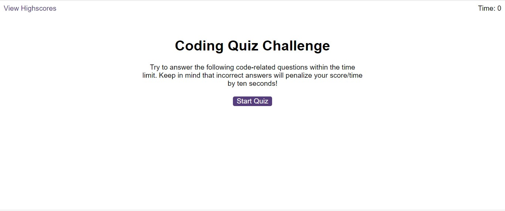
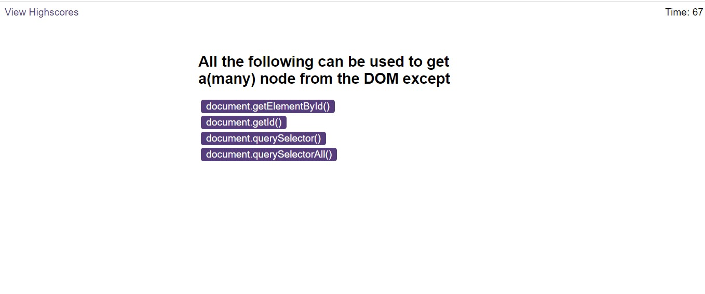

# code-quiz

## Description
This project illustrates the use of javascript to dynamically inject html and css code in to the DOM. In here several techniques have been used including bootstrap, DOM api, modular programming technique. The project simply presents coding questions to the user within a time frame. The quiz ends if the time is up or all questions have been answered. if the the user selects a wrong answer at any point, the time drops by 10 seconds. Find the link to the deployed application [here]().

## Features
Several Features have been developed here
 - timing
 - Responsiveness
 - Scores display

## Deployment
 Below is a preview of the deployed application

   

 Questions display page

   

 Scores page

 
